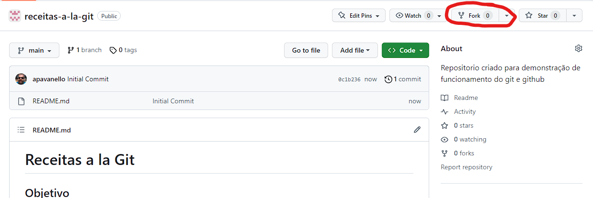
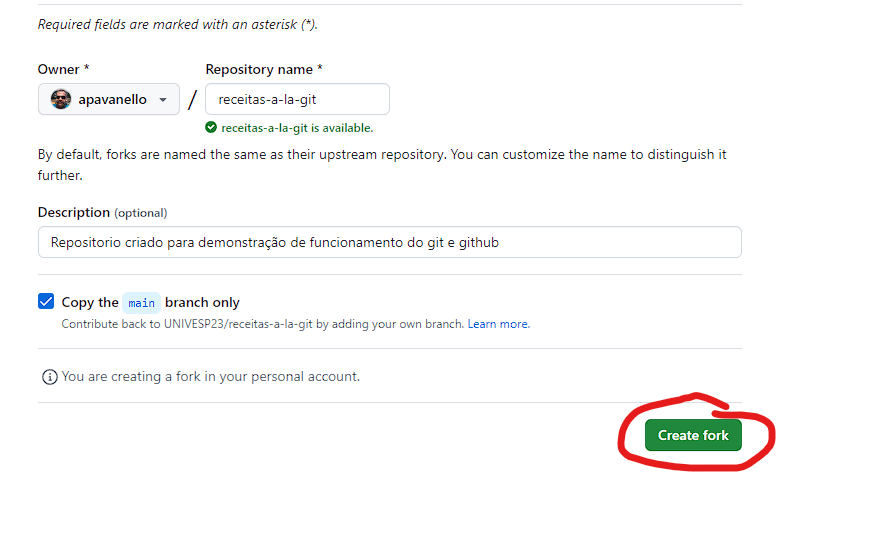
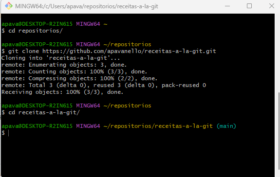
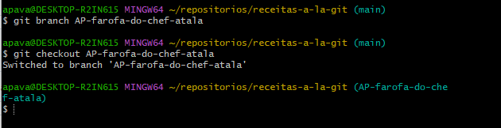
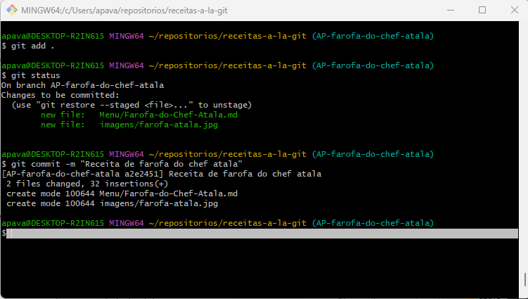
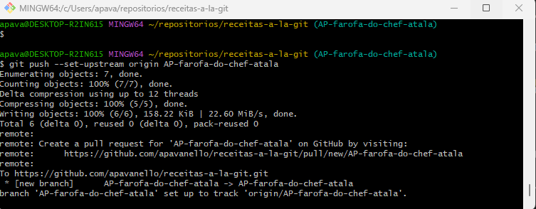
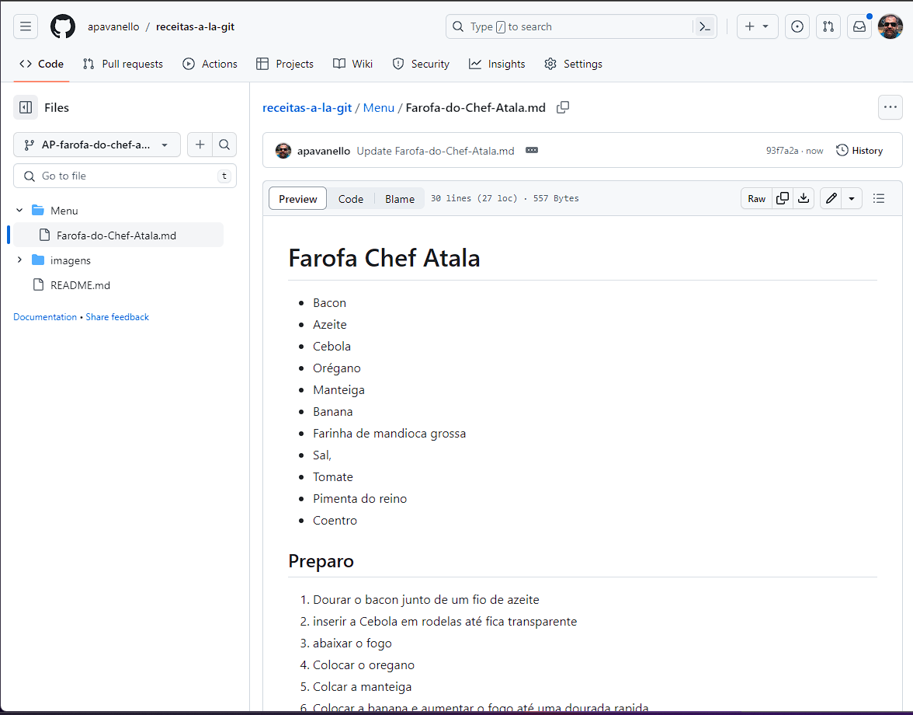
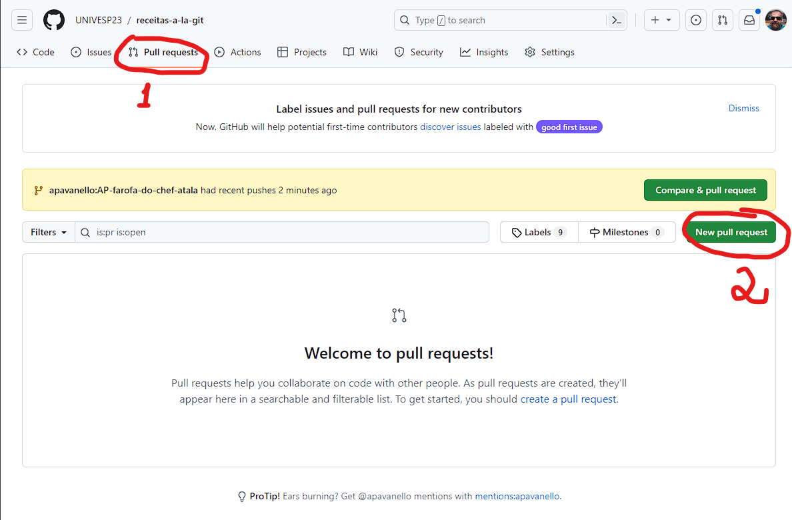
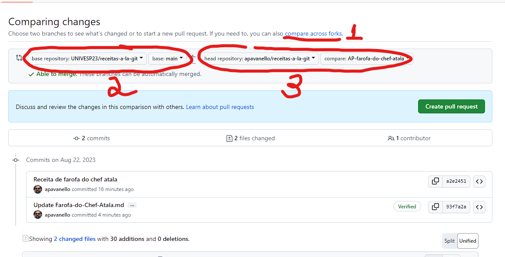
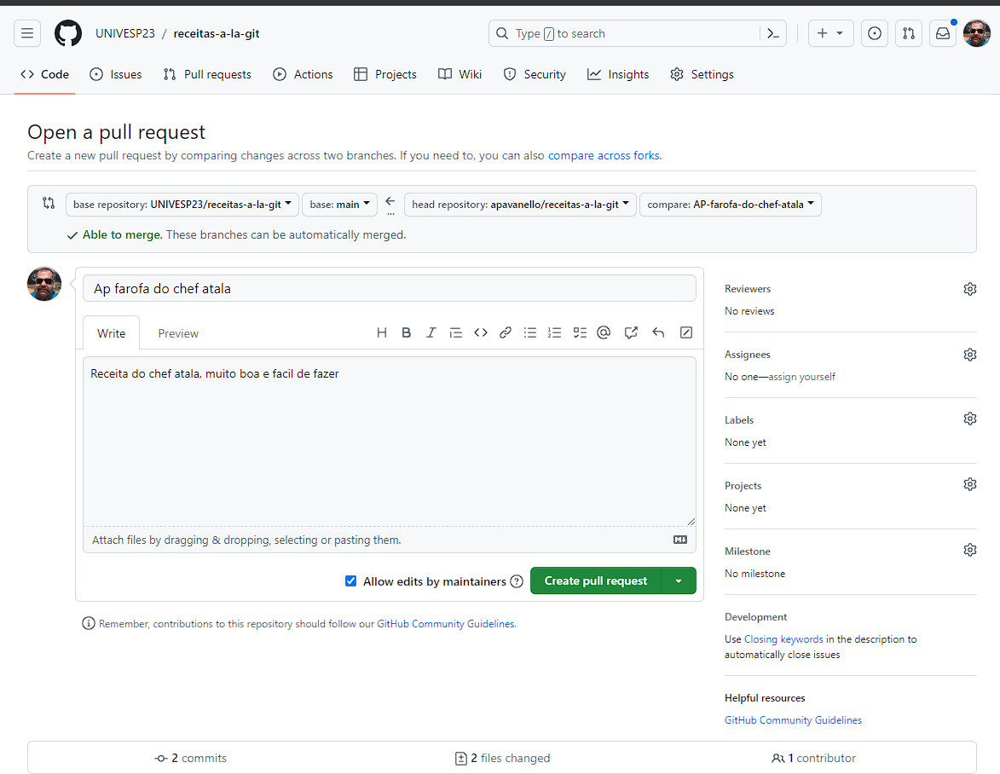

# Receitas a la Git
## Objetivo
O objetivo desse repositorio é para auxiliar os alunos da UNIVESP a entender o funcionamento de um ciclo de colaboração no Github.

## Como utilizar
A ideia é montar um organizado de receitas, cada aluno irá efetuar:
1. O **fork** do repositorio
1. O **clone** deste repositorio _"forkado"_
1. Criar uma nova branch com o nome neste padrão **\<siglas do nome\>\-<nome da receita em [Kebab-case](https://coodesh.com/blog/candidates/dicas/convencoes-de-codificacao-do-camelcase-ao-kebab-case/#:~:text=Muito%20parecido%20com%20a%20conven%C3%A7%C3%A3o,%2Dde%2Dkebab%2Dcase.)>**;
1. Adicionar a receita na pasta **Menu** e caso tenha imagens na pasta **imagens**, recomenda-se usar **[Markdown](https://pt.wikipedia.org/wiki/Markdown)** para formatar o texto, mas se não souber pode deixar sem foratação;
1. Efetuar o Commit
1. Subir a branch para o **seu** repositorio
1. Criar uma nova **Pull Request** para o repositorio de origem na **Branch** Main

## Passo a passo
### 1. Faça o **fork** do repositorio:

Deve-se efetuar o **fork** deste repositorio [receitas-a-la-git](https://github.com/UNIVESP23/receitas-a-la-git)
clicando no botão de **Fork** no canto superior direito.


E depois clique em Create Fork, isso vai duplicar o repositorio para sua conta pessoal do Github, assim voce pode efetuar qualquer edição que queira


### 2. Faça o clone deste repositorio "forkado"

Na sua maquina abra o terminal do git, o `git Bash`.
Digite o caminho do local onde dexeja fazer o download do repositorio. Por exemplo eu vou salvar o repositorio em uma pasta no meu perfil chamada `repositorios`.
Digite o comando `cd [pasta de destino]` seguido pela pasta onde vai ficar o repositorio
exemplo:
``` bash
$ cd repositorios
```

Agora realize o **Clone** do seu repositorio usando o comando `git clone [repositorio]`. Lembrando que voce deve clonar o repositorio que voce **"Forkou"**, ou seja o repositorio no seu usuario do Github.
exemplo:
```bash
$ git clone https://github.com/apavanello/receitas-a-la-git.git
```

Com isso uma "copia" do repositorio será salva na sua maquina

Lembre de entrar dentro da pasta do repositorio clonado antes de realizar os proximos passos:



### 3. Criar uma nova branch com o nome neste padrão \<siglas do nome\>-\<nome da receita em Kebab-case\>

Para criar uma nova **branch** rode o comando:

`git branch <nome da branch>`

Isso ira criar uma nova **branch** mas não vai trocar para a mesma de imediato. Para realizar a troca digite:

`git checkout <nome da branch>`

Caso queira realizar tudo de uma vez digite o comando:

`git checkout -b <nome da branch>`

Assim o git vai criar a **branch** caso ela não exista e já mudar o estado atual para a mesma

> obs.: pode-se ver qual a branch atual digitando o comando `git branch`, o mesmo ira listar todas as branchs criadas e colocar um "*" na frente da que está ativa

> Obs2.: Lembre da sintaxe obrigatoria para a **branch** no nosso projeto, no meu caso ela fica assim:
"`AP-farofa-do-chef-atala`"

Exemplo:
```bash
$ cd receitas-a-la-git/

$ git branch AP-farofa-do-chef-atala

$ git checkout AP-farofa-do-chef-atala
```



### 4.Adicionar a receita na pasta Menu:

Agora voce já pode digitar a sua receita. Para isso crie u arquivo de texto na pasta do repositorio local, abra seu editor de texto favorido e pode começar a digitar a receita.

Para nosso exemplo vou usar o notepad por sua siplicidade, no terminal que está aberto digite o comando `notepad` para abrir rapidamente o programa.
Vou digitar a receita no formato Markdown, para mais info sobre esse formato acesse **[aqui](https://pt.wikipedia.org/wiki/Markdown)**.
Quando finalizar salve o arquivo na pasta **Menu**, de um nome que referencie a receita.
No exemplo salvei como `"Farofa-do-Chef-Atala.md"`, a extenção `.md` faz referencia a formatação **Markdown**

### 5. Efetuar o Commit
Assim que finalizar de salvar sua receita é preciso fazer o git reconhecer o arquivo e adicionalo ao versionador, para isso vamos executar o comando `"git add ."`

Para ver quais arquivo foram editados desde o ultimo **commit** digite `git status`

Para salvar as edições digite `git commit -m <mensagem sobre o commit>`

exemplo:
```bash
$ git add .


$ git status
On branch AP-farofa-do-chef-atala
Changes to be committed:
  (use "git restore --staged <file>..." to unstage)
        new file:   Menu/Farofa-do-Chef-Atala.md
        new file:   imagens/farofa-atala.jpg


$ git commit -m "Receita de farofa do chef atala"
[AP-farofa-do-chef-atala a2e2451] Receita de farofa do chef atala
 2 files changed, 32 insertions(+)
 create mode 100644 Menu/Farofa-do-Chef-Atala.md
 create mode 100644 imagens/farofa-atala.jpg


```
Pronto agora suas alterações foram versionadas e salvas.



### 6. Subir a branch para o seu repositorio
Agora vamos fazer o upload das suas modificações para o **seu** repositorio do Github.
na primeira vez precisamos falar para o git qual o destino do nosso repositorio isso vamos adicionar as configurações do repositorio remoto que está no **Github**, digite o comando:

`git push --set-upstream origin <nome da sua branch>`

Nas proxias alterações nessa branch pode-se utilizar o comando:

`git push`

Exemplo:
```bash
$ git push --set-upstream origin AP-farofa-do-chef-atala
Enumerating objects: 7, done.
Counting objects: 100% (7/7), done.
Delta compression using up to 12 threads
Compressing objects: 100% (5/5), done.
Writing objects: 100% (6/6), 158.22 KiB | 22.60 MiB/s, done.
Total 6 (delta 0), reused 0 (delta 0), pack-reused 0
remote:
remote: Create a pull request for 'AP-farofa-do-chef-atala' on GitHub by visiting:
remote:      https://github.com/apavanello/receitas-a-la-git/pull/new/AP-farofa-do-chef-atala
remote:
To https://github.com/apavanello/receitas-a-la-git.git
 * [new branch]      AP-farofa-do-chef-atala -> AP-farofa-do-chef-atala
branch 'AP-farofa-do-chef-atala' set up to track 'origin/AP-farofa-do-chef-atala'.

```


### 7. Criar uma nova Pull Request para o repositorio de origem na Branch Main

para a ultia etapa vamos fazer um **Pull Request**, que na pratica é solicitar que nossa alteração vá para o repositorio orgininal, no nosso caso o repositorio do grupo.

Se acessarmos o repositorio no nosso perfil podemos verificar que as alterações estão lá, ou seja lá já consta a nossa receita, mas no repositorio central do grupo ainda não.

>OBS.: Lembre de mudar a branch  no github para a branch que criamos



Agora vamos criar o Pull request, para isso vá no repositorio oficial [link](https://github.com/UNIVESP23/receitas-a-la-git), clique em Pull Request e depois em New Pull request



Selecione **Compare across Forks**(1) e selecione a branch de destino(2) e origem(3).
Sendo que a branch de destino é a do grupo UNIVESP e a branch é a **MAIN**, e a de origem é a do seu perfil e a branch que criamos.

Abaixo é possivel ver um resumo das diferenças entre as Branchs.



Precione **Create Pull Request** caso esteja tudo ok, adicione um texto sobre a mudança na proxima tela e precione **Create Pull Request** novamente.



Pronto Seu **Pull request já foi criado, agora só aguardar um Mantendor do repositorio aprovar e sua receita estará disponivel a todos.
